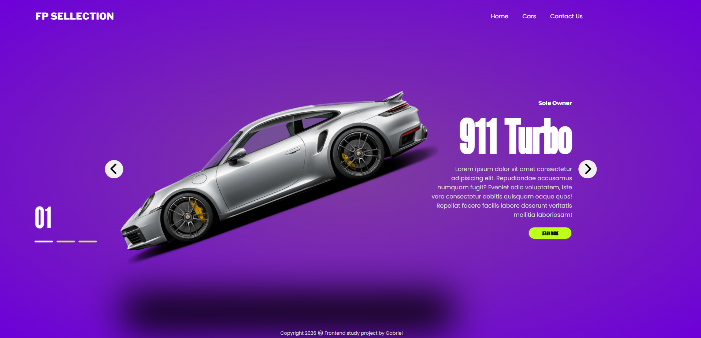

<h1 align="center" style="font-weight: bold;">🚘 CARS WEBSITE</h1>

<p align="center">
    <b>This project was developed to improve my front-end development skills, focusing on creating interactive user experiences, dynamic content updates, and modern product showcase interfaces. It is part of my personal portfolio and represents my continuous learning journey as a developer.</b>
</p>

<h2 id="layout">🎨 Layout</h2>

<p align="center">
    
</p>

<h2 id="technologies">💻 Technologies</h2>

<p>
   HTML5
  <br>
   CSS3
  <br>
   JavaScript
</p>

<h2 id="features">✨ Features</h2>

- Interactive car selection system</br>
- Dynamic vehicle information display</br>
- Real-time image updates</br>
- Smooth transition effects</br>
- Modern landing page design</br>
- Engaging user experience


<h2 id="started">🚀 Getting started</h2>

<h3>Prerequisites</h3>

The following tools are required to run the project locally:

- [Git](https://git-scm.com)
- [Any Modern Web Browser](https://www.google.com/intl/pt-BR/chrome/)

<h3>Cloning</h3>

```bash
git clone https://github.com/gabrielolivete/car-demo-pjt.git
```

<h3>Starting</h3>

```bash
cd car-demo-pjt
```
Use the VS Code Live Server extension for a better development experience.

</br>

<p>
     <a href="https://gabrielolivete.github.io/car-demo-pjt/">📱 Visit this Project</a>
</p>

</br>

<h2 id="learn">💾 What I Learned</h2>

- Improved JavaScript DOM manipulation skills
- Practiced creating interactive user interfaces
- Enhanced CSS animation techniques
- Learned how to build product-focused landing pages
- Improved front-end project organization

<hr>

<p align="center">
Built by Gabriel Olivete to practice Frontend Development
</p>